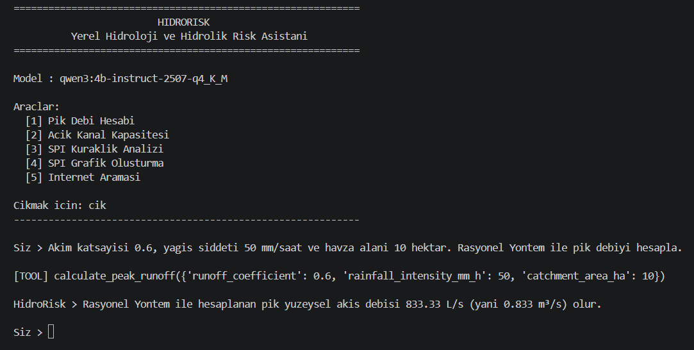
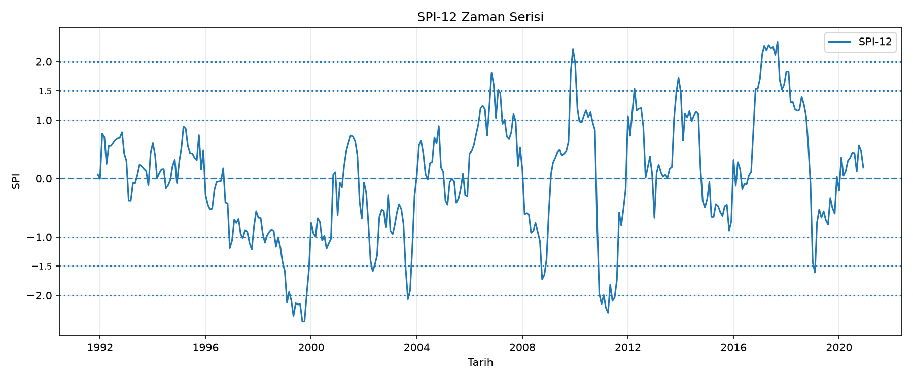

# HidroRisk

HidroRisk, yerel bir LLM (Ollama üzerinden çalışan Qwen modeli) ile geliştirilmiş, **hidroloji ve hidrolik odaklı bir tool-calling asistanıdır**.

Bu proje, ders kapsamında verilen `ollama_asistan` yapısı temel alınarak özelleştirilmiştir. Örnek medikal senaryo yerine, hidroloji ve hidrolik alanına yönelik bir senaryo tasarlanmıştır.

## Proje Amacı

Bu asistanın amacı, kullanıcının sorduğu hidroloji/hidrolik sorularında:

- gerekli ise uygun aracı (tool) çağırmak,
- sayısal hesapları uygun araçları kullanarak gerçekleştirmek,
- sonuçları Türkçe ve anlaşılır biçimde sunmak,
- gerektiğinde internet araması yapmak,
- SPI analizi ve grafik üretimi gibi işlemleri desteklemektir.

## Senaryo

Bu proje genel amaçlı bir asistan yerine, hidroloji ve hidrolik alanına odaklanan bir senaryo ile geliştirilmiştir:

**HidroRisk = Yerel Hidroloji ve Hidrolik Risk Asistanı**

Asistan özellikle şu alanlara odaklanır:

- Rasyonel Yöntem ile pik debi hesabı
- Manning denklemi ile açık kanal kapasite kontrolü
- Aylık yağış verilerinden SPI hesabı
- SPI zaman serisi grafiği oluşturma
- Gerekli durumlarda internet araması

## Kullanılan Model

- **LLM:** `qwen3:4b-instruct-2507-q4_K_M`
- **Çalıştırma ortamı:** Ollama (local)
- **Arayüz:** Terminal / CLI

## Özellikler / Tool'lar

Projede aşağıdaki araçlar bulunmaktadır:

1. **calculate_peak_runoff**
   - Rasyonel Yöntem ile pik yüzey akış debisi hesaplar.

2. **check_channel_capacity**
   - Manning denklemi ile dikdörtgen açık kanalın tasarım debisini taşıyıp taşıyamayacağını kontrol eder.

3. **calculate_spi**
   - Aylık yağış verisi içeren CSV dosyasından SPI hesaplar.

4. **plot_spi_series**
   - SPI zaman serisi grafiği üretir ve PNG olarak kaydeder.

5. **internet_search**
   - internet aramasında konuya özel sayfaları genel ana sayfalara göre önceliklendiren sonuç filtreleme geliştirilmiştir.

## Kısa Kavramlar

- **Pik Debi:** Belirli bir olay sırasında oluşan en yüksek akış debisidir.

- **Rasyonel Yöntem:** Yağış şiddeti, havza alanı ve akım katsayısını kullanarak küçük havzalarda pik debiyi tahmin etmek için kullanılan basit bir yöntemdir.

- **Manning Denklemi:** Açık kanallardaki akış hızı ve debisini; kanal geometrisi, eğim ve pürüzlülük gibi özelliklere göre hesaplamak için kullanılan bir denklemdir.

- **Manning n Katsayısı:** Kanal yüzeyinin akışa karşı gösterdiği pürüzlülüğü temsil eden katsayıdır.

- **SPI (Standartlaştırılmış Yağış İndisi):** Yağış verilerini kullanarak belirli bir dönemin normalden ne kadar kurak veya nemli olduğunu standartlaştırılmış bir değerle ifade eden indekstir.

- **SPI-12:** SPI'nin 12 aylık yağış birikimi üzerinden hesaplanan biçimidir. Uzun dönemli yağış eksikliği veya fazlalığının değerlendirilmesinde kullanılır.

- **Açık Kanal:** Su yüzeyinin atmosferle temas ettiği kanal, dere veya benzeri akış sistemidir.

## Proje Yapısı

```text
hidrorisk/
│
├── assets/
│   ├── hidrorisk_terminal.png
│   └── spi12_example.png
│
├── data/
│   └── yagis_ornek.csv
│
├── outputs/
│   └── (program calistikca olusan grafik dosyalari)
│
├── chat.py
├── tools.py
├── ollama_client.py
├── requirements.txt
├── .gitignore
└── README.md
```

## Kurulum
1) Repoyu klonlayın

```text
git clone https://github.com/skrkc/hidrorisk.git
cd hidrorisk
```

2) Sanal ortam oluşturun ve aktif edin

Windows PowerShell veya VS Code içindeki PowerShell terminali:

```powershell
python -m venv .venv
.\.venv\Scripts\Activate.ps1
```

3) Gerekli paketleri kurun

```powershell
python -m pip install -r requirements.txt
```

4) Ollama’yı açın

Ollama uygulamasının açık olması gerekir.

5) Gerekli modeli indirin

```powershell
ollama pull qwen3:4b-instruct-2507-q4_K_M
```

## Çalıştırma

```powershell
python chat.py
```

### Örnek Terminal Arayüzü

Program açıldığında aşağıdaki gibi bir ekran görülür:

```text

============================================================
                         HIDRORISK
          Yerel Hidroloji ve Hidrolik Risk Asistanı
============================================================

Model : qwen3:4b-instruct-2507-q4_K_M

Araçlar:
  [1] Pik Debi Hesabı
  [2] Açık Kanal Kapasitesi
  [3] SPI Kuraklık Analizi
  [4] SPI Grafik Oluşturma
  [5] İnternet Araması

Çıkmak için: çık
------------------------------------------------------------
```

#### Terminal Görünümü



### Örnek Konuşmalar

#### 1) Kavramsal Soru

Kullanıcı:

```text
Manning denklemi ne için kullanılır? Kısa cevap ver.
```

Asistan:

```text
Manning denklemi, açık kanal akışında su debisini hesaplamak için kullanılır. Bu denklem, kanalın geometrisi, eğimi, su derinliği ve Manning n katsayısı gibi parametrelerle su akış debisini belirler.
```

#### 2) Pik Debi Hesabı (Rasyonel Yöntem)

Kullanıcı:

```text
Akım katsayısı 0.6, yağış şiddeti 50 mm/saat ve havza alanı 10 hektar. Rasyonel Yöntem ile pik debiyi hesapla.
```

Tool çağrısı:

```text
[TOOL] calculate_peak_runoff({'runoff_coefficient': 0.6, 'rainfall_intensity_mm_h': 50, 'catchment_area_ha': 10})
```

Asistan:

```text
Rasyonel Yöntem ile hesaplanan pik yüzeysel akış debisi 0.833 m³/s (yani 833.33 L/s) olur.
```

#### 3) Açık Kanal Kapasite Kontrolü

Kullanıcı:

```text
Tasarım debisi 2 m³/s olan dikdörtgen bir kanalın genişliği 2 m, su derinliği 1 m, Manning n katsayısı 0.015 ve taban eğimi 0.001. Kanal bu debiyi taşıyabilir mi?
```

Tool çağrısı:

```text
[TOOL] check_channel_capacity({'design_discharge_m3_s': 2, 'width_m': 2, 'water_depth_m': 1, 'manning_n': 0.015, 'bed_slope': 0.001})
```

Asistan:

```text
Evet, kanal tasarımı 2 m³/s tasarım debisini taşıyabilir. Manning denklemine göre kanalın kapasitesi 2.656 m³/s olup, bu değer tasarım debiden büyük olduğu için yeterlidir.
```

#### Multi-turn örneği

Kullanıcı:

```text
Peki tasarım debisi 3 m3/s olsaydı?
```

Tool çağrısı:

```text
[TOOL] check_channel_capacity({'design_discharge_m3_s': 3, 'width_m': 2, 'water_depth_m': 1, 'manning_n': 0.015, 'bed_slope': 0.001})
```

Asistan:

```text
Hayır, tasarım debisi 3 m³/s olduğunda kanal bu debiyi taşıyamaz. Manning denklemine göre kanalın kapasitesi 2.656 m³/s olup, tasarım debisinden küçük olduğu için yetersizdir.
```

#### 4) SPI Hesabı ve Grafik Oluşturma

Kullanıcı:

```text
data/yagis_ornek.csv dosyası için SPI-12 hesapla ve grafiğini oluştur.
```

Tool çağrıları:

```text
[TOOL] calculate_spi({'file_path': 'data/yagis_ornek.csv', 'scale': 12})

[TOOL] plot_spi_series({'file_path': 'data/yagis_ornek.csv', 'scale': 12})
```

Asistan:

```text
Son tarihteki SPI-12 değeri 0.187'dir ve bu değer "normale yakin" sınıfına aittir. Bu sınıf, veri serisinin genel durumunu yansıtmaz; sadece 2020-12 dönemini temsil eder.

Grafik, "D:\KURSLAR\Mugibu_UYZ\hidrorisk\outputs\yagis_ornek_spi12_plot.png" yolu üzerinde oluşturulmuştur.
```

#### Örnek SPI Grafiği



#### 5) İnternet Araması

Kullanıcı:

```text
İnternetten DSİ'nin taşkın yönetimiyle ilgili 3 kaynak bul.
```

Tool çağrısı:

```text
[TOOL] internet_search({'query': 'DSI taşkın yönetimi', 'max_results': 3})
```

Asistan:

```text
1. Devlet Su İşleri Genel Müdürlüğü - DSİ
   https://dsi.gov.tr/Sayfa/Detay/1872

2. Devlet Su İşleri Genel Müdürlüğü - DSİ
   https://dsi.gov.tr/Sayfa/Detay/1870

3. TAŞKIN RİSK YÖNETİMİ - Sayistay
   https://www.sayistay.gov.tr/reports/download/3960-taskin-risk-yonetimi
```

## Önemli Notlar

- HidroRisk bir ön değerlendirme asistanıdır.
- Sonuçlar, nihai mühendislik projesi veya resmi onay yerine kullanılmamalıdır.
- Asistanın raporladığı "Son SPI-X" değeri ve sınıfı yalnızca belirtilen son dönemi temsil eder; tüm veri serisinin genel durumu gibi yorumlanmamalıdır.
- İnternet araması sonuçlarında araçtan dönmeyen kaynaklar/URL’ler eklenmez.

## Kullanılan Veri

Projede örnek amaçlı sentetik bir aylık yağış verisi kullanılmıştır:

- `data/yagis_ornek.csv`

Bu dosya, SPI analizi ve grafik üretimi için örnek veri sağlamaktadır.

## Geliştirme Özeti

Bu projede, verilen örnek `ollama_asistan` yapısı korunarak:

- medikal senaryo kaldırılmış,
- yerine hidroloji/hidrolik odaklı bir senaryo eklenmiş,
- özel tool’lar geliştirilmiş,
- terminal arayüzü düzenlenmiş,
- SPI grafiği üreten ek bir görselleştirme aracı eklenmiştir.

## Kullanım Notu

Bu proje eğitim amaçlı hazırlanmıştır.
